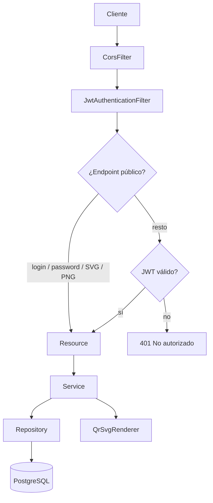
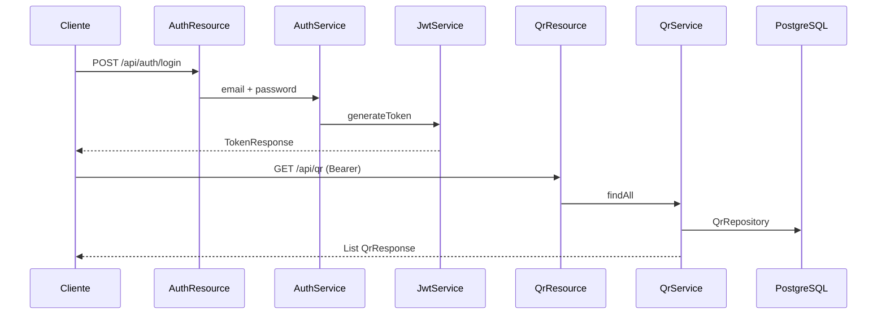
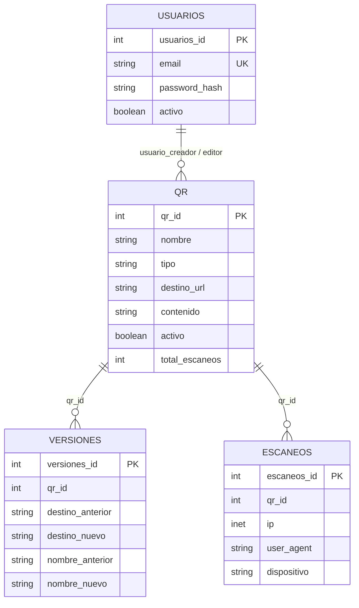
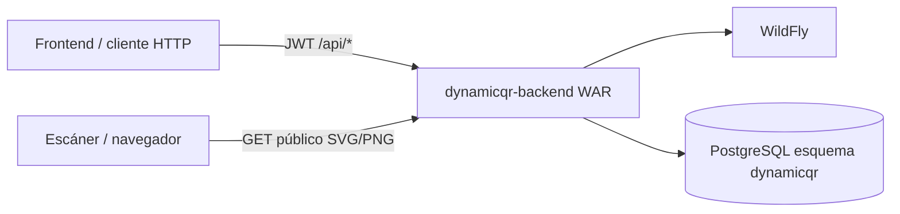

# dynamicqr-backend

API REST para administrar códigos QR, generar su imagen (SVG/PNG) y autenticar usuarios con JWT.


---

## Descripción

`dynamicqr-backend` es el backend del producto de QR dinámicos. Expone una API REST que un frontend (u otro cliente HTTP) consume para:

- Registrar e iniciar sesión de usuarios de administración.
- Crear, consultar, editar y activar/desactivar códigos QR.
- Parametrizar el estilo visual y obtener el QR como SVG o PNG.
- Consultar el historial de cambios de nombre y destino (`versiones`).

El artefacto se empaqueta como **WAR** (`dynamicqr-backend.war`) para desplegarse en un servidor de aplicaciones **WildFly**. El descriptor `jboss-deployment-structure.xml` aísla JPA, CDI, JSF y JAX-RS del servidor para que Spring Boot use su propio Hibernate.

Hoy, un QR de tipo `url` se genera con el **destino final** dentro de la imagen. La URL corta interna (`/r/{id}`), el conteo de escaneos y los endpoints de `EscaneoResource` existen en código **comentados**, pendientes de un despliegue público.

---

## Características

- Autenticación JWT (JJWT), sesión sin estado.
- Login por correo completo o por el prefijo anterior a `@` si es único.
- Contraseñas definitivas con **Argon2**; contraseñas temporales con hash propio (`$tmp$` + SHA-256).
- CRUD de usuarios: alta, edición y *toggle* de `activo` (no hay borrado físico).
- CRUD de QR con tipos `url`, `texto`, `wifi`, `vcard`, `email` y `telefono`.
- Estilo visual: color de módulos, fondo, gradiente, forma de módulo y forma de ojos.
- Generación de imagen con **ZXing** (corrección de error **H**, quiet zone 2, UTF-8) en SVG y PNG.
- Historial de cambios de nombre/destino en `versiones`.
- CORS abierto para clientes en otro origen.
- Validación Bean Validation en los bodies de entrada.
- Auditoría (`usuario_creador`, `fecha_creacion`, `usuario_editor`, `fecha_edicion`) en las entidades.

---

## Arquitectura

Capas bajo `src/main/java/dynamicqr`. No hay módulos Maven adicionales: un único artefacto WAR.

```
Cliente HTTP
    │
    ▼
CorsFilter  →  JwtAuthenticationFilter  →  Resource (@RestController)
    │
    ▼
Service  (+ AuthService / JwtService)
    │
    ├── QrSvgRenderer / QrContenidoMapper   (sin persistencia)
    ▼
Repository (Spring Data JPA)
    │
    ▼
PostgreSQL  (esquema dynamicqr)
```

| Paquete | Responsabilidad |
|---|---|
| `dynamicqr` | Arranque (`DynamicqrBackendApplication`) y `WildFlyEntityManagerFactoryFix` |
| `resource` | Contratos HTTP, CORS y `ResourceExceptionHandler` |
| `security` | JWT, filtro, login, Argon2 y endpoints públicos |
| `service` | Reglas de negocio, repositorios JPA y renderizado |
| `dto` | Request/response JSON |
| `domain` | Entidades JPA y enumeraciones |

Los *resources* no acceden a repositorios. El id del usuario autenticado lo aporta `SecurityUtils` desde el token, no el body.



---

## Funcionamiento

### Petición autenticada

1. El cliente llama a `/api/...` con `Authorization: Bearer <token>`.
2. `JwtAuthenticationFilter` extrae el subject (email), carga el usuario con `UsuarioUserDetailsService` y deja el principal en el `SecurityContext` si el token es válido y la cuenta está activa.
3. El *resource* valida el body (`@Valid`) y delega en el *service*.
4. El *service* persiste o consulta vía `JpaRepository` y arma el DTO de respuesta.
5. Errores de dominio: `EntityNotFoundException` → 404; `IllegalArgumentException` → 400. En alta/edición/toggle de usuarios y QR, el *resource* captura cualquier excepción y responde 400 con `MensajeResponse`.

### Login y contraseña temporal

1. `POST /api/auth/login` (público).
2. Si el hash es Argon2, `AuthenticationManager` verifica la contraseña y `JwtService` emite el token.
3. Si el hash es temporal (`$tmp$...`) o texto legado, el login **no** emite JWT: `token` vacío, `duracion` 0 y `requiereCambioPassword: true`.
4. `POST /api/auth/password` (público) intercambia la temporal por Argon2 y entonces sí emite JWT.
5. Una cuenta inactiva responde 403 (`DisabledException`). Credenciales inválidas: 401.

### Generación visual del QR

1. `GET /api/qr/{id}/svg` o `/png` (públicos, solo GET).
2. `QrService` carga la entidad y calcula el payload: en tipo `url` usa `destinoUrl`; en el resto, el `payload` guardado en `contenido`.
3. `QrSvgRenderer` codifica la matriz con ZXing y pinta módulos/ojos según el estilo persistido.

### Actualización de un QR

Al `PUT /api/qr/{id}`, `QrService` valida destino o contenido, reescribe el JSON de `contenido` (`QrContenidoMapper`) y, si cambian nombre o destino, `VersionService.registrarCambio` inserta una fila en `versiones`.



---

## Tecnologías

| Tecnología | Versión | Uso |
|---|---|---|
| Java | 21 | Lenguaje (`pom.xml` → `java.version`) |
| Spring Boot | 3.4.13 | Framework (parent Maven) |
| Spring Web | (BOM 3.4.13) | API REST |
| Spring Security | (BOM 3.4.13) | Filtro JWT, `AuthenticationManager`, CORS |
| Spring Data JPA / Hibernate | (BOM 3.4.13) | Persistencia |
| PostgreSQL JDBC | runtime (BOM) | Driver |
| JJWT | 0.12.6 | Emisión y validación de JWT (HMAC) |
| Bouncy Castle | 1.80 | Backend criptográfico de Argon2 |
| ZXing Core | 3.5.3 | Matriz QR (ECC H) |
| Jakarta Validation | (starter-validation) | `@NotBlank`, `@Email`, `@Size` |
| SLF4J JBoss LogManager | 2.1.0.Final (provided) | Logging en WildFly |
| Maven Wrapper | Maven 3.9.16 | Build |
| JUnit Jupiter | vía `spring-boot-starter-test` | Test de contexto |
| Empaquetado | WAR | `finalName` = `dynamicqr-backend` |
| Runtime objetivo | WildFly + Tomcat `provided` | `SpringBootServletInitializer` |

No hay cliente HTTP propio (`RestTemplate` / `WebClient`), ni Flyway/Liquibase, ni Docker, ni OpenAPI/SpringDoc en este repositorio.

---

## Estructura del proyecto

```
dynamicqr-backend/
├── pom.xml
├── mvnw
├── mvnw.cmd
├── .mvn/wrapper/maven-wrapper.properties
├── README.md
└── src/
    ├── main/
    │   ├── java/dynamicqr/
    │   │   ├── DynamicqrBackendApplication.java
    │   │   ├── WildFlyEntityManagerFactoryFix.java
    │   │   ├── domain/          # Entidades y enums
    │   │   ├── dto/             # Contratos JSON
    │   │   ├── resource/        # Controllers REST + CORS + errores
    │   │   ├── security/        # JWT, login, Argon2
    │   │   └── service/         # Negocio, repos JPA, SVG/PNG
    │   ├── resources/
    │   │   └── application.properties
    │   └── webapp/WEB-INF/
    │       ├── beans.xml
    │       └── jboss-deployment-structure.xml
    └── test/java/dynamicqr/
        └── DynamicqrBackendApplicationTests.java
```

`beans.xml` declara `bean-discovery-mode="none"` para que Weld de WildFly no gestione los beans de Spring.

---

## API

Context-root en WildFly (nombre del WAR): `/dynamicqr-backend`.

Base local documentada en `app.public-base-url`:

`http://localhost:8080/dynamicqr-backend`

### Autenticación — `AuthResource`

| Método | Endpoint | Descripción | Auth |
|---|---|---|---|
| POST | `/api/auth/login` | Inicia sesión | Público |
| POST | `/api/auth/password` | Cambia contraseña temporal por definitiva y emite JWT | Público |
| POST | `/api/auth/register` | Crea un usuario con contraseña en claro (se hashea Argon2) | **JWT** |

`register` puede abrirse temporalmente descomentando el `permitAll` en `SecurityConfig` y el bypass en `JwtAuthenticationFilter` (flujo del primer administrador). En el código actual **exige token**.

**Login body** (`LoginRequest`): `email`, `password`.

**Login 200** (`TokenResponse`):

```json
{
  "token": "<jwt>",
  "duracion": 60,
  "usuarioId": 1,
  "requiereCambioPassword": false
}
```

`duracion` está en minutos (`app.jwt.expiration-ms` / 60_000). Si la cuenta usa contraseña temporal, `token` va vacío y `requiereCambioPassword` es `true`.

**Cambio de password** (`CambioPasswordRequest`): `email`, `password` (temporal), `passwordNueva` (mínimo 6 caracteres).

**Register 201** (`RegisterRequest` → `UsuarioResponse`) con header `Location: /api/usuarios/{id}`.

### Usuarios — `UsuarioResource`

| Método | Endpoint | Descripción | Auth |
|---|---|---|---|
| GET | `/api/usuarios` | Listar | JWT |
| GET | `/api/usuarios/{id}` | Obtener | JWT |
| POST | `/api/usuarios` | Crear (password aleatoria Argon2; no se devuelve) | JWT |
| PUT | `/api/usuarios/{id}` | Actualizar datos | JWT |
| DELETE | `/api/usuarios/{id}` | Alterna `activo` (no borra la fila) | JWT |
| POST | `/api/usuarios/{id}/password-temporal` | Genera y **devuelve** una password temporal de 10 caracteres | JWT |

Alta por este recurso: `UsuarioCreateRequest` (`email`, `nombre`, `apellidoPaterno`, `apellidoMaterno`). No recibe password; el servicio genera un UUID, lo hashea y el usuario entra después con password temporal.

Respuestas de escritura: `MensajeResponse` (`{ "mensaje": "..." }`), 201 en alta, 200 en update/toggle, 400 si falla.

`UsuarioResponse` no incluye `passwordHash`.

### QR — `QrResource`

| Método | Endpoint | Descripción | Auth |
|---|---|---|---|
| GET | `/api/qr` | Listar | JWT |
| GET | `/api/qr/{id}` | Obtener | JWT |
| GET | `/api/qr/{id}/svg` | Imagen SVG | Público (GET) |
| GET | `/api/qr/{id}/png` | Imagen PNG | Público (GET) |
| GET | `/api/qr/{id}/versiones` | Historial del código | JWT |
| POST | `/api/qr` | Crear | JWT |
| PUT | `/api/qr/{id}` | Actualizar (opcional `nota` para el historial) | JWT |
| DELETE | `/api/qr/{id}` | Alterna `activo` | JWT |

**Alta** (`QrCreateRequest`):

| Campo | Notas |
|---|---|
| `nombre` | Obligatorio |
| `tipo` | Por defecto `url`. Valores: `url`, `texto`, `wifi`, `vcard`, `email`, `telefono` |
| `destinoUrl` | Obligatorio si `tipo` es `url`; debe empezar por `http://` o `https://` |
| `contenido` | Obligatorio si el tipo no es `url` |
| `estilo` | Opcional (`QrEstiloRequest`) |

**Estilo** (`QrEstiloRequest`):

| Campo | Default |
|---|---|
| `colorModulos` | `#111827` |
| `colorFondo` | `#FFFFFF` (`transparent` / `none` = sin rectángulo de fondo) |
| `colorGradiente` | vacío (sin gradiente) |
| `formaModulo` | `redondeado` (`cuadrado`, `suave`, `redondeado`, `extra_redondeado`, `circulo`, `diamante`) |
| `formaOjo` | `redondeado` (`cuadrado`, `redondeado`, `extra_redondeado`, `circulo`) |

Colores aceptados: hex `#RGB`–`#RRGGBBAA`.

`QrResponse` incluye `urlSvg` y `urlPng` construidas con `app.public-base-url`. `urlRedireccion` está en el DTO pero **no se rellena** mientras la URL corta esté comentada. `contenido` en la respuesta es `null` para tipo `url`.

### Versiones — `VersionResource`

| Método | Endpoint | Descripción | Auth |
|---|---|---|---|
| GET | `/api/versiones` | Listar; query opcional `?qrId=` | JWT |
| GET | `/api/versiones/{id}` | Obtener | JWT |

No hay POST/PUT/DELETE públicos: las filas las crea `QrService.update`.

### No expuestos (código comentado)

| Recurso | Path previsto | Estado |
|---|---|---|
| `QrRedirectResource` | `GET /r/{id}` | Clase vacía; redirección 302 y registro de escaneo comentados |
| `EscaneoResource` | `GET /api/escaneos`, `GET /api/escaneos/{id}` | No es `@RestController` activo |
| `QrResource` | `GET /api/qr/{id}/escaneos` | Comentado |

`EscaneoService` y `EscaneoRepository` sí existen y pueden persistir IP, user-agent, dispositivo, navegador, SO y referrer. `pais` y `ciudad` están en la entidad; el registro actual **no** los rellena.

### Códigos HTTP observados

| Código | Cuándo |
|---|---|
| 200 | Lecturas, update, toggle, login con Argon2, SVG/PNG |
| 201 | `POST /api/auth/register`, `POST /api/usuarios`, `POST /api/qr` |
| 400 | Validación de negocio / `IllegalArgumentException` / error genérico en write |
| 401 | Sin token, token inválido (`No autorizado`) o credenciales incorrectas |
| 403 | Cuenta `activo = false` |
| 404 | GET de entidad inexistente (`{"error":"..."}`) |

No hay handler específico para errores Bean Validation: aplica el de Spring Boot.

---

## Seguridad

- **Modelo:** JWT en header `Authorization: Bearer`, `SessionCreationPolicy.STATELESS`, CSRF desactivado.
- **Firma:** HMAC con `app.jwt.secret` (`JWT_SECRET`). Claim `sub` = email, claim `uid` = id de usuario, expiración `app.jwt.expiration-ms` (por defecto 3_600_000 ms).
- **Públicos** (`PublicEndpointMatcher`): `POST /api/auth/login`, `POST /api/auth/password`, `OPTIONS /**`, y GET de `/api/qr/{id}/svg` y `/png`.
- **Resto:** autenticado. No hay `@PreAuthorize` ni distinción de roles en rutas. `UsuarioUserDetails` asigna `ROLE_USER` a todos.
- **Passwords definitivas:** `Argon2PasswordEncoder.defaultsForSpringSecurity_v5_8()`.
- **Passwords temporales:** `PasswordTemporalHasher` (`$tmp$` + salt + SHA-256). El alta desde `UsuarioResource` no envía password al cliente; hay que llamar a `/password-temporal`.
- **Cuentas desactivadas:** no autenticables (`isEnabled()` = `activo`).
- **CORS** (`CorsConfig`): `allowedOriginPattern *`, métodos GET/POST/PUT/PATCH/DELETE/OPTIONS, `allowCredentials true`, `maxAge` 3600.
- **Secretos:** no versionar contraseñas ni `JWT_SECRET`. Hay valores por defecto en `application.properties` solo para desarrollo local; sustituirlos en el entorno.

---

## Base de datos

- **Motor:** PostgreSQL.
- **URL por defecto:** `jdbc:postgresql://localhost:5432/db_dynamicqr`.
- **Esquema:** `dynamicqr` (`hibernate.default_schema`).
- **DDL:** `spring.jpa.hibernate.ddl-auto=none`. El esquema **no** lo crea Hibernate; no hay Flyway/Liquibase en el repo.
- **ORM:** Spring Data JPA. Las FKs son enteros (`usuario_creador`, `qr_id`, …), sin `@ManyToOne`.
- **Zona horaria JDBC:** UTC. `Qr.fechaEdicion` usa `WallClockLocalDateTimeConverter`.

| Tabla | Entidad | Rol |
|---|---|---|
| `usuarios` | `Usuario` | Cuentas. Unique `uq_usuarios_email` |
| `qr` | `Qr` | Código, destino, contenido JSON, `total_escaneos` |
| `versiones` | `Version` | Historial de nombre/destino |
| `escaneos` | `Escaneo` | Lecturas (IP `inet`, UA, geo prevista) |

`contenido` guarda un JSON `{ "estilo": {...}, "payload": "..." }` (`QrContenidoEnvelope`). En tipo `url`, `payload` es `null` y el destino vive en `destino_url`.

Índices declarados en las entidades: `ix_usuarios_usuario_*`, `ix_qr_activo`, `ix_qr_usuario_*`, `ix_versiones_qr_id`, `ix_escaneos_qr_id`, `ix_escaneos_fecha_creacion`.



---

## Integraciones

No hay llamadas a APIs externas en el código activo.

- **ZXing** y **Java2D / ImageIO** son librerías locales (matriz + SVG/PNG).
- **UserAgentParser** clasifica dispositivo/navegador/SO a partir del header; no consulta un servicio de geolocalización.
- `app.qr-bridge-url` está comentado en `application.properties`.

---

## Requisitos

- JDK 21
- Maven 3.9.16 (o el wrapper `mvnw` / `mvnw.cmd`)
- PostgreSQL con la base `db_dynamicqr` y el esquema `dynamicqr` ya creados
- WildFly para el despliegue WAR (Tomcat embebido va con scope `provided`; Logback está excluido a propósito)

---

## Instalación

```powershell
git clone <url-del-repositorio>
cd dynamicqr-backend
.\mvnw.cmd -DskipTests package
```

El WAR queda en `target/dynamicqr-backend.war`.

---

## Configuración

Archivo: `src/main/resources/application.properties`.

| Clave / variable | Default de desarrollo | Uso |
|---|---|---|
| `server.port` | `8080` | Puerto del Tomcat embebido |
| `spring.datasource.url` | `jdbc:postgresql://localhost:5432/db_dynamicqr` | JDBC |
| `spring.datasource.username` | *(configurar)* | Usuario DB |
| `spring.datasource.password` | *(configurar)* | Password DB |
| `spring.jpa.hibernate.ddl-auto` | `none` | No genera esquema |
| `spring.jpa.properties.hibernate.default_schema` | `dynamicqr` | Esquema |
| `app.jwt.secret` / `JWT_SECRET` | *(definir en el entorno)* | Firma HMAC del JWT |
| `app.jwt.expiration-ms` | `3600000` | TTL del token |
| `app.public-base-url` / `PUBLIC_BASE_URL` | `http://localhost:8080/dynamicqr-backend` | Prefijo de `urlSvg` / `urlPng` |

Ejemplo de override (valores de ejemplo, no secretos reales):

```properties
spring.datasource.url=jdbc:postgresql://localhost:5432/db_dynamicqr
spring.datasource.username=<usuario>
spring.datasource.password=<password>
app.jwt.secret=${JWT_SECRET}
app.public-base-url=${PUBLIC_BASE_URL:http://localhost:8080/dynamicqr-backend}
```

---

## Ejecución

### Compilar el WAR

```powershell
.\mvnw.cmd -DskipTests package
```

Copiar `target/dynamicqr-backend.war` al directorio `standalone/deployments` de WildFly.

### Tests

```powershell
.\mvnw.cmd test
```

El arranque embebido (`main` en `DynamicqrBackendApplication`) existe, pero no es el camino principal: el logging de Logback está excluido y el initializer de servlet fuerza `JavaLoggingSystem` para WildFly.

---

## Testing

| Qué | Detalle |
|---|---|
| Framework | JUnit Jupiter vía `spring-boot-starter-test` |
| Archivo | `src/test/java/dynamicqr/DynamicqrBackendApplicationTests.java` |
| Caso | `contextLoads()` (`@SpringBootTest`) |
| Integración / unitarios de negocio | No hay más tests |
| Cobertura | No hay plugin JaCoCo |
| `spring-security-test` | Declarado en `pom.xml`; no se usa |

El test carga el contexto completo, incluida la datasource de PostgreSQL. No hay `application-test.properties` ni H2.

---

## Ejemplos de uso

### Login

```http
POST /dynamicqr-backend/api/auth/login
Content-Type: application/json

{
  "email": "admin@ejemplo.com",
  "password": "<password>"
}
```

### Crear un QR de tipo URL

```http
POST /dynamicqr-backend/api/qr
Authorization: Bearer <jwt>
Content-Type: application/json

{
  "nombre": "Carta del restaurante",
  "tipo": "url",
  "destinoUrl": "https://ejemplo.com/menu",
  "estilo": {
    "colorModulos": "#111827",
    "colorFondo": "#FFFFFF",
    "formaModulo": "redondeado",
    "formaOjo": "redondeado"
  }
}
```

Respuesta 201:

```json
{ "mensaje": "qr creado correctamente" }
```

### Obtener SVG (público)

```http
GET /dynamicqr-backend/api/qr/1/svg
```

`Content-Type: image/svg+xml`

### Password temporal

```http
POST /dynamicqr-backend/api/usuarios/2/password-temporal
Authorization: Bearer <jwt>
```

```json
{ "passwordTemporal": "<valor-de-un-solo-uso>" }
```

Después, `POST /api/auth/login` devolverá `requiereCambioPassword: true` y habrá que llamar a `POST /api/auth/password`.

---

## Arquitectura general



En un despliegue público futuro, el SVG de tipo `url` pasaría a codificar `/r/{id}` (hoy apunta a `destinoUrl`).

---

## Estado del proyecto

Versión Maven: **0.0.1-SNAPSHOT**. Desarrollo activo.

| Área | Estado |
|---|---|
| API de usuarios, QR y versiones | Operativa, protegida con JWT |
| Login / password temporal / Argon2 | Operativo |
| SVG y PNG con estilo | Operativo; GET de imagen público |
| URL corta `/r/{id}` y conteo de escaneos | Implementado y **desactivado** (comentado) |
| Migraciones versionadas | No hay Flyway/Liquibase |
| OpenAPI | No hay SpringDoc |
| Docker / CI en el repo | No hay |
| Tests | Solo `contextLoads` |
| Roles granulares | No se usan en las rutas |

---

## Licencia

No hay archivo `LICENSE` en el repositorio.
